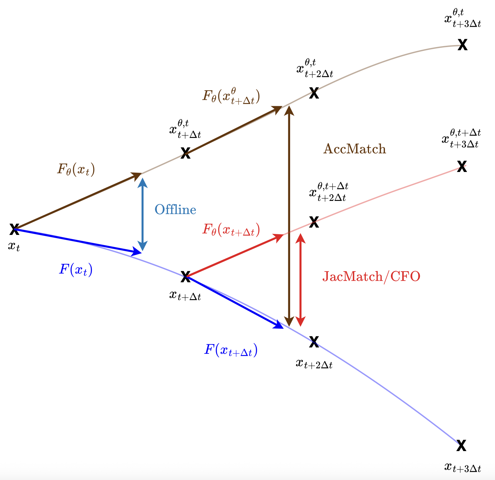

# jax-phynity

Implementation of _Unrolled gradients in disguise: bridging interpolation-based and Jacobian regularization for stable neural dynamics_ (Janvier et al., NeurIPS 2026) in JAX.

## Organisation of repository
- `configs`: config YAML file to determine dataset, model, training parameters... `configs_args.yaml` and `config_args_inf.yaml` for understanding the different options in config files 
- `datasets`: BaseDataset and ODEDataset (when data is generated) to generate and format data for training
- `losses`: build losses of the paper 
- `solvers`: custom Runge-Kutta solvers based on Butcher Tableaux (derived from diffrax)
- `utils.py`: loggers, init weights...
- `networks.py`: architectures
- `forecasters.py`: NODE (Chen et al. 2019), SNODE (White et al. 2024) and Hybrid forecaster methods
- `train_jaxphynity.py`: training routine
- `inference.py`: inference on test data, based on different metrics in `metrics.py`

## Run an experiment
To run an experiment, you just have to fill a `my_config.yaml` file in the `config` folder (details of the different parameters in `configs_args.yaml`) and then run `python train_jaxphynity.py --config config/my_config.yaml`. 

The process is the same for the inference, with the `config_args_inf.yaml` as an example and running `inference.py`. 
